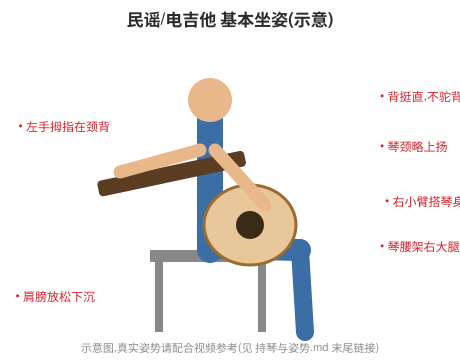

# 🪑 持琴与姿势

姿势是地基。错误姿势会让你弹得费力、容易疲劳甚至受伤,还会限制技术上限。
花点时间把它做对,后面一切都更顺。

---

## 一、坐姿(最常见的练习姿势)

> 📷 关于图片:本知识库的图示(和弦图、指板图、姿势图等)用矢量图(SVG)绘制,精确且随仓库版本管理。
> 但**姿势这类动作,静态示意图无法完全替代真实视频**。强烈建议配合视频学习——
> 在视频平台搜索"吉他 正确坐姿 持琴""guitar proper posture",对照模仿。本文末尾有要点自检清单。

### 民谣/电吉他常用坐姿
1. 坐在没有扶手的椅子上,坐稳、背挺直(别瘫着)。
2. 把琴的"腰窝"(琴身凹陷处)架在**右大腿**上(右撇子)。
3. 琴面与地面**垂直**(别为了看指板把琴面朝上翻,这会逼你弯脖子驼背)。
4. 琴颈略微抬高(琴头比琴身高一点),不要下垂。
5. 右小臂自然搭在琴身上缘。

### 古典坐姿
- 琴架在**左腿**上,**左脚踩脚凳**(或用支撑垫把琴垫高)。
- 琴颈抬得更高,琴头大约与头部同高。
- 这种姿势让两只手都能自由、放松地活动,适合精细的古典演奏。

## 二、站姿(用背带)

- 背带挂好,调到舒适高度。
- **关键**:调整背带让**站着和坐着时琴的位置尽量一致**,这样肌肉记忆通用。
- 琴别挂太低(看着酷但很难弹)。

## 三、左手(按弦手,右撇子)

- **拇指**:放在琴颈**背面**中间,与食指/中指大致相对,起支撑作用。不要一上来就用拇指勾住琴颈上沿(那是进阶的特定技巧)。
- **手指**:用**指尖**垂直按弦(不是指肚),按在**靠近品丝的前方**(不是品格正中,更不是压在品丝上)。
- **手腕**:自然微曲,不要过度折腕。
- **指甲**:左手指甲要剪短,否则无法用指尖立起来按弦。

> 按弦三要点:**用指尖、靠品丝、垂直按。** 这样最省力、最不容易闷音。

## 四、右手(拨弦/扫弦手)

### 用拨片
- 拨片用**拇指和食指**捏住,露出一点点尖端(露太多难控制)。
- 捏的力度:既不要松到掉,也不要僵硬死握。
- 手腕放松,扫弦主要靠**手腕转动**带动,不是整条手臂硬甩。

### 用手指(指弹/古典)
- 拇指(p)负责低音弦(4/5/6 弦),食中无名(i/m/a)负责高音弦(3/2/1 弦)。
- 手掌悬在弦上方,手指自然弯曲拨弦。

## 五、放松!(最重要的一点)

- 新手最大的通病是**全身紧绷**:肩膀耸起、手臂僵硬、左手死命掐。
- 紧张会让你弹得累、慢、容易受伤。
- 时常检查:肩膀有没有放下来?握琴颈的手是不是太用力?
- 用**刚好能按响**的最小力气按弦——这是一辈子都要练的"省力"功夫。

## 六、自检清单 ✅

- [ ] 背挺直,不驼背、不弯脖子去看指板
- [ ] 琴面垂直于地面
- [ ] 琴颈略微上扬
- [ ] 左手拇指在琴颈背面,用指尖按弦
- [ ] 肩膀放松下沉,手臂不僵硬
- [ ] 坐着和站着琴的位置接近

---

## ⚠️ 关于疼痛

- **指尖痛**:正常,几周后长茧缓解。
- **手腕/手臂/肩膀痛**:不正常!说明姿势紧张或别扭,停下来检查姿势,必要时休息。持续疼痛要重视,避免劳损伤(如腱鞘炎)。

---

> 我的笔记:(可以对着镜子或录像检查自己的姿势,记录需要改进的地方。)
