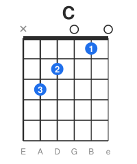
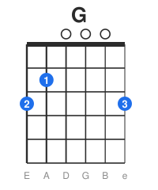
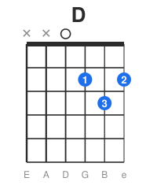
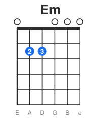
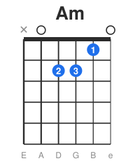
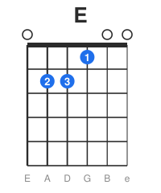
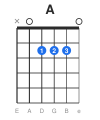
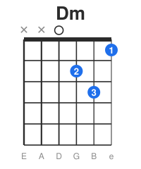
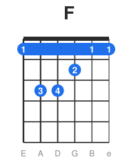

# 🎶 第一批开放和弦(Open Chords)

开放和弦是含有空弦的、按在前三品的基础和弦。它们是吉他的"字母表"——
掌握这 8 个,你就能弹海量歌曲。

> 读图约定:数字=品(0=空弦,X=不弹);括号里是建议手指(1食 2中 3无名 4小指)。
> 弦的顺序统一写成 **6 5 4 3 2 1**(从粗到细)。

> 💡 下面每个和弦都配了**和弦图**。图中:✕=不弹该弦,○=空弦弹响,圆圈里的数字=用哪根手指(1食2中3无名4小指),最上方粗线=弦枕。和弦图的读法详见 [看懂和弦图与TAB谱.md](./看懂和弦图与TAB谱.md)。

### 和弦图一览

| | | |
|:-:|:-:|:-:|
|  |  |  |
|  |  |  |
|  |  |  |

---

## 必学 8 和弦

### C 大调(C major)
```
6 5 4 3 2 1
X 3 2 0 1 0
  3=无名指(5弦3品)
  2=中指  (4弦2品)
  1=食指  (2弦1品)
```
明亮、稳定,几乎每首歌都会用到。6 弦不弹。

### G 大调(G major)
```
6 5 4 3 2 1
3 2 0 0 0 3
  2=中指  (6弦3品)  ← 也有用其他指法版本
  1=食指  (5弦2品)
  3/4=无名/小指(1弦3品)
```
洪亮、开阔。常用 2-1-3/4 指型,方便切到别的和弦。

### D 大调(D major)
```
6 5 4 3 2 1
X X 0 2 3 2
  1=食指  (3弦2品)
  3=无名指(2弦3品)
  2=中指  (1弦2品)
```
三个高音弦组成的小三角形指型。6、5 弦不弹。

### E 小调(E minor)—— 最容易的和弦
```
6 5 4 3 2 1
0 2 2 0 0 0
  2=中指  (5弦2品)
  3=无名指(4弦2品)
```
只用两根手指,六根弦全弹,声音饱满忧郁。**新手第一个和弦的首选。**

### A 小调(A minor)
```
6 5 4 3 2 1
X 0 2 2 1 0
  2=中指  (4弦2品)
  3=无名指(3弦2品)
  1=食指  (2弦1品)
```
和 C、E 的指型很像,方便切换。

### E 大调(E major)
```
6 5 4 3 2 1
0 2 2 1 0 0
  1=食指  (3弦1品)
  2=中指  (5弦2品)
  3=无名指(4弦2品)
```
六弦全响,饱满有力,摇滚布鲁斯常用。

### A 大调(A major)
```
6 5 4 3 2 1
X 0 2 2 2 0
  三根手指挤在2品的 4/3/2 弦上
```
三指挤在 2 品,手指粗的人可微调或用横按变体。

### D 小调(D minor)
```
6 5 4 3 2 1
X X 0 2 3 1
  1=食指  (1弦1品)
  2=中指  (3弦2品)
  3=无名指(2弦3品)
```
忧郁、深沉。和 D 大调只差一个音。

---

## 练习方法

### 1. 单独按好每个和弦
- 一根根弦拨,检查**每根该响的弦都清晰响起**,没有闷音或打品。
- 闷音常见原因:手指没立起来(用了指肚)、碰到了相邻弦、力度不够。
- 调整手指角度,用**指尖**、按在**靠品丝处**。

### 2. 从最简单的开始
推荐顺序:**Em → Am → C → G → D → E → A → Dm**
(Em 最简单,逐步增加难度。)

### 3. 按响 → 松开 → 再按
- 按好一个和弦,扫一下确认干净;松开手;再重新按同一个。
- 重复,训练手指**一次到位**地落到正确位置。

---

## 常见问题与解决

| 问题 | 原因 | 解决 |
|------|------|------|
| 某根弦闷/不响 | 手指没立起、碰到邻弦 | 指尖垂直按、调整角度 |
| 打品(滋滋声) | 力度不够 / 没按实 | 稍加力,按在靠品丝处 |
| 手指够不到 | 手没张开 / 拇指位置不对 | 拇指放琴颈背中央,放松张开 |
| 换和弦太慢 | 正常,需练习 | 见 `换和弦练习.md` |
| 指尖很痛 | 还没长茧 | 正常,坚持几周,适度休息 |

---

## 和弦速查表(本批)

| 和弦 | 6 | 5 | 4 | 3 | 2 | 1 | 性格 |
|------|---|---|---|---|---|---|------|
| Em | 0 | 2 | 2 | 0 | 0 | 0 | 忧郁/最易 |
| Am | X | 0 | 2 | 2 | 1 | 0 | 柔和 |
| C  | X | 3 | 2 | 0 | 1 | 0 | 明亮 |
| G  | 3 | 2 | 0 | 0 | 0 | 3 | 洪亮 |
| D  | X | X | 0 | 2 | 3 | 2 | 明亮 |
| E  | 0 | 2 | 2 | 1 | 0 | 0 | 有力 |
| A  | X | 0 | 2 | 2 | 2 | 0 | 明快 |
| Dm | X | X | 0 | 2 | 3 | 1 | 忧郁 |

---

## 自检清单 ✅

- [ ] 8 个和弦每个都能让该响的弦干净响起
- [ ] 不看手能按出 Em、Am、C、G
- [ ] 理解闷音/打品的原因并能自我纠正

> 接下来:进入 `换和弦练习.md`,把这些和弦"连"起来。

---

> 我的笔记:(记录你最难按的和弦,单独多练。)
