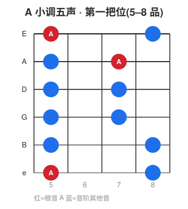

# 🪜 音阶入门

音阶是按特定音程排列的一串音,是旋律和即兴的"调色盘"。
掌握大调、小调和五声音阶,你就拥有了即兴和理解音乐的基础。

---

## 一、大调音阶(Major Scale)—— 一切的基准

大调音阶由 7 个音组成,音程排列(全=全音,半=半音):

```
全 - 全 - 半 - 全 - 全 - 全 - 半
```

以 **C 大调**为例(从 C 开始套用上面的公式):
```
C —全→ D —全→ E —半→ F —全→ G —全→ A —全→ B —半→ C
1     2      3     4     5     6     7     8(回到1)
```
- C 大调全是自然音(白键),没有升降号,所以最常用来讲解。
- 用唱名就是熟悉的 **do re mi fa sol la si do**。

**记住这个"全全半全全全半"公式**,套在任何音上都能拼出该调的大调音阶。
例:G 大调 = G A B C D E **F#** G(为了维持公式,第 7 音必须升成 F#)。

## 二、自然小调音阶(Natural Minor)

音程公式:
```
全 - 半 - 全 - 全 - 半 - 全 - 全
```
以 **A 小调**为例(也全是白键):
```
A —全→ B —半→ C —全→ D —全→ E —半→ F —全→ G —全→ A
```

### 关系大小调(超重要的省力概念)
- **C 大调和 A 小调用的是完全相同的 7 个音!** 只是"从哪个音开始/以哪个音为中心"不同。
- 每个大调都有一个**关系小调**,位置在大调的**第 6 音**上(C 的第 6 音是 A → A 小调)。
- 反过来:小调的关系大调在其**第 3 音**上。

> 这意味着:学会一个调的音,就同时掌握了它的关系大小调。事半功倍。

### 小调的另外两种形式(进阶了解)
- **和声小调(Harmonic minor)**:升高第 7 音(A 小调里 G→G#),产生属和弦的张力,常用于古典和新古典金属。
- **旋律小调(Melodic minor)**:上行升高 6、7 音,下行还原,爵士中应用广泛。

## 三、五声音阶(Pentatonic)—— 即兴神器

五声音阶只用 5 个音,去掉了容易"踩雷"的两个音,所以**怎么弹都不太会错**,是即兴的最佳起点。

### 小调五声音阶(Minor Pentatonic)
在自然小调里去掉第 2 和第 6 音:
```
A 小调五声: A  C  D  E  G  (A)
            1  b3 4  5  b7
```
布鲁斯、摇滚 solo 的核心。

### 大调五声音阶(Major Pentatonic)
在大调里去掉第 4 和第 7 音:
```
C 大调五声: C  D  E  G  A  (C)
            1  2  3  5  6
```
明亮愉悦,乡村、流行常用。

> A 小调五声和 C 大调五声又是**关系大小调**,音相同,只是中心不同。

### 吉他上的五声音阶第一把位(最常用)
A 小调五声"盒子型"(从 5 品开始):



```
e|---5---8---|
B|---5---8---|
G|---5---7---|
D|---5---7---|
A|---5---7---|
E|---5---8---|
```
这个"盒子(box)"形状,平移到不同品就是不同调的小调五声。
把根音(6 弦上的音)对到目标调,就完成了转调——这就是吉他的几何之美。

## 四、布鲁斯音阶(Blues Scale)

在小调五声里加一个"蓝调音(b5)":
```
A 蓝调: A  C  D  Eb  E  G  (A)
              加了 Eb(b5)
```
那个 Eb 经过音带来标志性的"布鲁斯味道"。

## 五、怎么练音阶

1. **慢速 + 节拍器**,上行下行,追求每个音清晰均匀。
2. 关注**左手指法经济**(一指一品的把位分配)和**右手交替拨弦**。
3. 不要只当手指操,**用耳朵听**音阶的色彩(大调亮、小调暗)。
4. 练好一个把位后,试着**即兴**:放一段伴奏(backing track),只用这个音阶随便弹,找乐感。

---

## 自检清单 ✅

- [ ] 记住大调公式"全全半全全全半"
- [ ] 理解关系大小调(C 大调 ↔ A 小调同音)
- [ ] 能在吉他上弹出 A 小调五声第一把位
- [ ] 能把五声盒子平移到其他调
- [ ] 能用五声音阶在伴奏上即兴一小段

---

> 我的笔记:(找一个 A 小调的 backing track,每天即兴几分钟,记录感受。)
