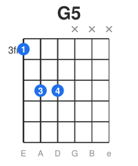
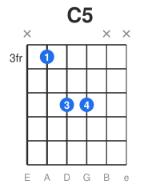

# 🎸 节奏吉他与强力和弦

节奏吉他(rhythm guitar)是乐队的"引擎",负责律动和和声铺垫。很多人只想练 solo,
却忽略了节奏吉他——而**绝大多数时候,你在乐队里弹的是节奏**。好的节奏吉他手非常抢手。

---

## 一、强力和弦(Power Chord)

摇滚、朋克、金属的基石。它**只有根音 + 五度(有时加高八度根音)**,没有三音。

### 为什么没有三音
- 没有三音 → 没有大小之分 → 加上失真也不会浑浊(三音在重失真下会"打架"变脏)。
- 音色干净、有力、"中性",适合任何调式背景。

### 指型(可移动)

 

**根音在 6 弦(标记 5,如 G5)**
```
6 5 4 3 2 1
3 5 X X X X    ← 食指(6弦3品=G根音)+ 无名指(5弦5品=五度)
(可加小指 4弦5品 = 高八度根音,更饱满)
```

**根音在 5 弦(如 C5)**
```
6 5 4 3 2 1
X 3 5 X X X    ← 食指(5弦3品=C根音)+ 无名指(4弦5品)
```

> 这两个形状**平移**到不同品就是不同的强力和弦。把根音对到 6/5 弦的目标音(见 `05/指板音名记忆.md`)即可。例:6 弦 5 品 = A5,8 品 = C5。

### 关键技巧
- 食指/无名指(+小指)是固定形状,整体在指板上"滑来滑去"。
- **闷掉不弹的弦**:左手余指轻搭高音弦,右手只扫低音那 2-3 根。
- 配合 **palm mute**(见 `07/闷音与切音.md`)做出经典的"咚咚咚"摇滚律动。

## 二、节奏吉他的核心:律动(Groove)

节奏吉他的灵魂不是"弹了什么和弦",而是"**怎么弹、在哪个拍点弹**"。

### 八分音符驱动(摇滚/朋克)
持续的八分音符下扫强力和弦,是无数摇滚歌的引擎:
```
↓ ↓ ↓ ↓ ↓ ↓ ↓ ↓
1 & 2 & 3 & 4 &
(全下扫,palm mute 控制松紧)
```
- 全部下扫得到统一、有力的攻击感(朋克常用)。
- 快速时改用交替(下上)拨弦。

### 闷音 + 重音(动态律动)
```
P.M. 闷音持续,在特定拍点"放开"和弦做重音:
x x x X x x x X   (大写 X = 放开的强力和弦重音)
```
这种"闷—放"的对比制造了金属/硬摇滚的张力。

### 切分与留白(放克/流行)
- 不要每拍都弹满。在反拍(&)上的切分重音,制造律动的"弹性"。
- 留白(休止)和发声一样重要——它给律动"呼吸"。

## 三、节奏吉他的"角色意识"

在乐队里,节奏吉他要**为整体服务**,不抢戏:
- **跟紧鼓和贝斯**:你的扫弦/闷音要和军鼓(2、4 拍)、底鼓锁定。
- **留频率空间**:主歌克制(少弹、轻弹),副歌放开(多弹、重弹)。
- **多吉他时分工**:和另一把吉他错开音区/音色,别都弹同样的东西。
- **音色选择**:节奏部分常用偏中频、不要太多增益的音色,保证"颗粒清晰"。

## 四、不同风格的节奏吉他语汇

| 风格 | 节奏吉他特点 |
|------|--------------|
| 朋克 | 全下扫八分音符强力和弦,快、猛、简单 |
| 硬摇滚/金属 | palm mute 低音 riff + 重音放开,gallop 节奏 |
| 放克 | 十六分音符切音(scratch)+ 九和弦点缀,极重律动 |
| 雷鬼/Ska | 只弹反拍(& 上)的短促和弦 |
| 流行/民谣 | 开放和弦/横按扫弦,动态主副歌对比 |
| 乡村 | boom-chick 交替低音 + 和弦 |

## 五、练习方法

1. **强力和弦平移**:在 6 弦上练 G5→A5→C5→D5 移动,再到 5 弦组。
2. **八分音符耐力**:跟节拍器持续下扫强力和弦 2 分钟,保持稳定不松散。
3. **palm mute 控制**:练"闷—放"交替,做出动态对比。
4. **跟鼓练**:找鼓机/drum track,把你的扫弦"锁"在鼓的律动上。
5. **学一首 riff**:从经典 riff 入手(《Smoke on the Water》《Seven Nation Army》《Back in Black》),它们是节奏吉他的范本。

---

## 练习清单 ✅

- [ ] 强力和弦两个指型能在指板自由平移
- [ ] 能持续稳定地下扫八分音符强力和弦
- [ ] 会用 palm mute 做"闷—放"动态律动
- [ ] 能把扫弦律动锁在鼓点上
- [ ] 会弹至少 2 个经典摇滚 riff

---

> 我的笔记:(记录你在练的 riff 和喜欢的节奏吉他律动。)
